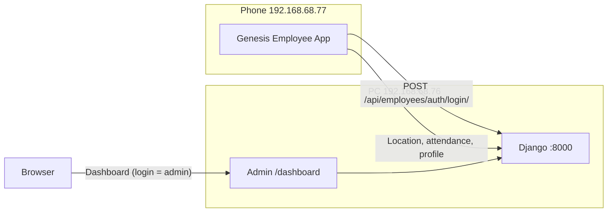

# Run and Test Web + App on Your Network

Your setup:

- **PC (web backend):** 192.168.68.76  
- **Mobile (app):** 192.168.68.77  
- **Same LAN:** app will call API at `http://192.168.68.76:8000/api`

---

## 1. Run the web backend on the PC

Backend must listen on **all interfaces** (0.0.0.0) so the phone can reach it. Two options:

### Option A: Docker (recommended)

- **Location:** [Genesis_Employee_Attendance](Genesis_Employee_Attendance/)
- **Start:** Run `docker-start.bat` (Windows) or `docker compose up -d --build` then `docker compose exec web python manage.py migrate`.
- Backend runs as `runserver 0.0.0.0:8000` ([docker-compose.yml](Genesis_Employee_Attendance/docker-compose.yml) line 31), so it is reachable from the LAN.

### Option B: Without Docker (Python only)

- Use [run_dev.bat](Genesis_Employee_Attendance/run_dev.bat) only after changing the runserver command: run `python manage.py runserver 0.0.0.0:8000` (not just `runserver`) so the server binds to all interfaces. The current script uses `runserver` and binds to 127.0.0.1 only.
- Ensure PostgreSQL (with PostGIS), Redis, venv, and `.env` are set up per [QUICK_START.md](Genesis_Employee_Attendance/QUICK_START.md).

---

## 2. Allow the PC IP in Django

So Django accepts requests to `http://192.168.68.76:8000`:

- **File:** [Genesis_Employee_Attendance/.env](Genesis_Employee_Attendance/env.example) (or your actual `.env` if present).
- Set:
  - `ALLOWED_HOSTS=localhost,127.0.0.1,192.168.68.76`
- If you use CORS for browser clients, add:
  - `CORS_ALLOWED_ORIGINS=http://localhost:8000,http://192.168.68.76:8000`  
  (App uses native HTTP, so CORS is only for the web dashboard in the browser.)

Restart the web container or dev server after changing `.env`.

---

## 3. Point the app to the PC

The app’s API base URL is hardcoded in [Genesis_Employee_App/lib/config/app_config.dart](Genesis_Employee_App/lib/config/app_config.dart) (line 5):

- **Current:** `baseUrl = 'http://192.168.68.50:8000/api'`
- **For your PC:** change to `baseUrl = 'http://192.168.68.76:8000/api'`

Then **rebuild and reinstall the APK** (e.g. run your release build script and install the new APK on the phone). The already-installed APK will keep using 192.168.68.50 until you install a build that uses 192.168.68.76.

---

## 4. Create login credentials on the backend

Run once on the PC (with backend running):

**If using Docker:**

```bash
cd Genesis_Employee_Attendance
docker compose exec web python create_admin.py
```

This creates:


| Use for                   | Type             | Email / Username                              | Password                                  |
| ------------------------- | ---------------- | --------------------------------------------- | ----------------------------------------- |
| **Web dashboard + Admin** | Django superuser | username: `admin`, email: `admin@genesis.com` | `admin123` (or `ADMIN_PASSWORD` from env) |
| **Mobile app**            | Employee         | `john.doe@genesis.com`                        | `employee123`                             |


**If not using Docker:** from the project root with venv activated and `DJANGO_SETTINGS_MODULE` set: `python create_admin.py`. Same credentials.

- **More employees (app login):** Django Admin → [http://192.168.68.76:8000/admin/](http://192.168.68.76:8000/admin/) → **Employees** → Add Employee (set email and password).
- **Web login:** only Django superuser (admin) can log into the dashboard; employee accounts are for the API/app only.

---

## 5. How to operate everything




### Web (on PC)

- **Dashboard:** [http://192.168.68.76:8000/dashboard/](http://192.168.68.76:8000/dashboard/)  
  - Login with **Django superuser** (e.g. `admin` / `admin123`).
  - Use: Live tracking, route history, reports, export CSV.
- **Admin:** [http://192.168.68.76:8000/admin/](http://192.168.68.76:8000/admin/)  
  - Same superuser. Manage employees, attendance, tracking data.

### Mobile app (on phone)

- Open app → Login with **employee** account: `john.doe@genesis.com` / `employee123` (or another employee you added in Admin).
- Use: Check-in/out, location sharing, view own attendance and profile.

### Quick verification

1. On PC browser: open [http://192.168.68.76:8000/api/](http://192.168.68.76:8000/api/) — you should see API root.
2. On PC: log in at [http://192.168.68.76:8000/dashboard/](http://192.168.68.76:8000/dashboard/) with admin.
3. On phone: log in to the app with `john.doe@genesis.com` / `employee123` (after app is rebuilt with baseUrl 192.168.68.76 and reinstalled).
4. On dashboard: open Live tracking and confirm the employee appears when the app is open and location is shared.

---

## 6. Summary checklist


| Step | Action                                                                                                                                                                            |
| ---- | --------------------------------------------------------------------------------------------------------------------------------------------------------------------------------- |
| 1    | Start backend on PC (Docker: `docker-start.bat` + migrate; or `runserver 0.0.0.0:8000`)                                                                                           |
| 2    | Set `ALLOWED_HOSTS=...,192.168.68.76` in `.env` and restart backend                                                                                                               |
| 3    | Set `baseUrl = 'http://192.168.68.76:8000/api'` in `app_config.dart`, rebuild APK, install on phone                                                                               |
| 4    | Run `create_admin.py` (via Docker or local) to create admin + first employee                                                                                                      |
| 5    | Web: open [http://192.168.68.76:8000/dashboard/](http://192.168.68.76:8000/dashboard/) and [http://192.168.68.76:8000/admin/](http://192.168.68.76:8000/admin/); login with admin |
| 6    | App: login with `john.doe@genesis.com` / `employee123` (or another employee from Admin)                                                                                           |


If the app shows “Invalid username or password” or connection errors, confirm: (1) backend is running on 192.168.68.76:8000, (2) installed APK was built with baseUrl 192.168.68.76, (3) firewall on PC allows port 8000, (4) credentials created by `create_admin.py` or Admin.