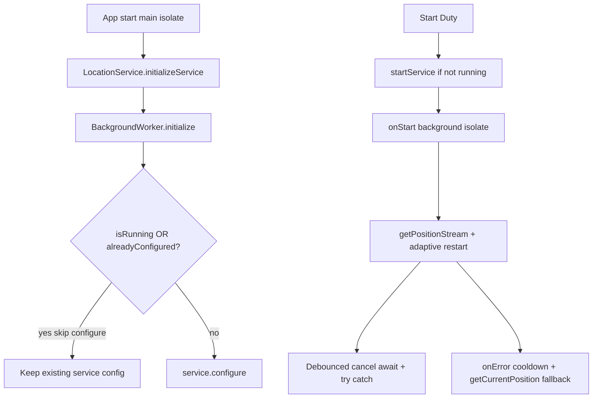

# SAFE FIX PLAN — Background Location Crash Hardening

**Status:** Decisions approved — ready to implement when you say execute. **No code until then.**

## Locked decisions (2026-07-14)

| Decision | Choice |
|----------|--------|
| Phasing | **Phase-1 first** (configure guard + stream await/cancel + try/catch + debounce + error cooldown). **Phase-2 later or never** (`forceLocationManager`) — only if Phase-1 does not sufficiently reduce crashes. |
| Debounce | **60 seconds** for GPS stream mode restart. Acceptable trade-off: mode flip can lag up to 60s when going stationary↔moving; **`getCurrentPosition` fallback + existing send timer keep points flowing** — no intentional location gap, only delayed filter mode. Validate on real devices in test matrix. |
| Rollout | **Staged Play only** — 5% → 20% → 50% → 100%. **Not** a full dump release. Halt rollout on new crash spike. Emulator ≠ OEM diversity. |

**Why Phase-2 stays deferred:** Medium risk (different location provider → accuracy/battery variance). Collect Phase-1 crash/telemetry first; skip Phase-2 if Phase-1 is enough.

**Scope:** Minimize crash risk from unguarded `configure()`, adaptive `getPositionStream` churn, and unhandled native Geolocator/NMEA failures. Keep current duty send cadence / displacement / session rules intact unless a change is explicitly needed for safety.

**Primary file:** [`Genesis_Employee_App/lib/services/background_worker.dart`](Genesis_Employee_App/lib/services/background_worker.dart)  
**Entry call site:** [`LocationService.initializeService()`](Genesis_Employee_App/lib/services/location_service.dart) (lines 31–40) ← [`main.dart`](Genesis_Employee_App/lib/main.dart) (~59)



---

## 1. Guard for `configure()`

### Where

In [`background_worker.dart`](Genesis_Employee_App/lib/services/background_worker.dart) **`initialize()`**, currently lines **50–93**, specifically the unguarded call at **75–90**:

```dart
await service.configure( ... );  // line 75 today
```

`startService` / `stopService` (95–107) already use `isRunning()` — mirror that pattern here.

### How (proposed)

1. Create `final service = FlutterBackgroundService();` (already line 56).
2. **Before** `configure()`:
   - If `await service.isRunning() == true` → **skip `configure()`**, log e.g. `BackgroundWorker: service already running – skipping configure`.
   - Else → call `configure()` as today.
3. Add a **Dart-side idempotency latch** (e.g. static `bool _configuredInThisProcess`) so rapid double-calls of `initializeService()` on the same main isolate (splash + home) do not re-`configure` even when service is stopped.
4. Still always allow creating the Android notification channel (68–73) — that is safe when already running.
5. Keep Workmanager `initialize` as-is for this PR unless it also double-fires noisily (out of scope unless testing shows it).

### What happens if we skip `configure()` when already running?

| Question | Answer |
|----------|--------|
| Does existing config stay valid? | **Yes** for the lifetime of that already-running Android foreground service. `onStart` is already loaded; listeners/`restartPositionStream` continue under the prior configuration. |
| After app upgrade while old service still alive? | Old Dart isolate may still be previous build until process dies. **Safe pattern:** skip configure while running; on next cold start after service stopped, re-`configure` with new code. Do **not** force-kill mid-duty in this PR. |
| Hot restart / `flutter run` with leftover service? | Skipping configure avoids the common “main isolate / Service already running / extra engines” re-entrancy that shows in your logs. |

**Risk: Low**

| Criterion | Assessment |
|-----------|------------|
| Affects working duty tracking? | No — does not change start/stop, GPS, or upload |
| Mid-duty session compatible? | Yes — running service untouched |
| Rollback | Revert the `if (!isRunning)` / latch block only |

---

## 2. Stream restart hardening (`restartPositionStream`)

### Current behavior (risk points)

In `onStart` (lines **158–171**, kickoff **184**, adaptive calls **209–222**):

- `positionSubscription?.cancel()` is **not awaited** — native listener can still be half-tearing down when a new stream starts.
- Stationary ↔ moving can call `restartPositionStream` on the **15s send timer**, so oscillations near the threshold can churn listeners.
- `onError` only `print`s — then adaptive logic may restart again while the platform binder is unhealthy.
- New stream recreation still goes through Fused Location + NMEA (`NmeaClient`) on Android — the JNI death path in your stack.

### Proposed hardening (behavior-preserving)

**A. Await dispose before recreate** (always)

```text
await positionSubscription?.cancel();
positionSubscription = null;
// optional short delay (e.g. 100–300ms) only after cancel, before new getPositionStream
```

Make `restartPositionStream` `async` and `await` callers (initial start + adaptive switches).

**B. Debounce / cooldown on mode switches — LOCKED at 60s**

- Track `DateTime? lastStreamRestartAt`.
- Refuse restart if last restart &lt; **60 seconds** (tunable via `AppConfig`, e.g. `bgStreamRestartDebounceSeconds = 60`).
- **Trade-off (accepted):** stationary→moving (e.g. enter vehicle) may lag mode change by up to 60s; send loop + `getCurrentPosition` fallback still upload — **gap risk is filter-mode latency, not lost tracking**.
- Add **hysteresis** where cheap: enter stationary after `stationaryThresholdMinutes`; leave stationary only after fresh movement evidence — reduces flap further inside the 60s window.
- Real-device test must explicitly check “sit then drive” to confirm points continue during the debounce window.

**C. Wrap restart body in try/catch**

- On failure: keep previous subscription if cancel failed weirdly; set `streamHealthy = false`; log; do **not** throw out of `onStart`.

**D. Optional Phase-2 (separate approval, Medium risk):** Prefer `AndroidSettings` with `forceLocationManager: true` (and/or disable unnecessary extras if API allows) to avoid Fused/NMEA path. **Not in Phase-1.** Validate on real devices with Google Play services first.

**Risk: Low–Medium** (A–C Low; D Medium)

| Criterion | Assessment |
|-----------|------------|
| Affects duty tracking? | Slightly — fewer stream flips when stationary/moving oscillates; **send timer + getCurrentPosition fallback still deliver points** |
| Mid-duty? | Yes — change applies only inside running isolate after deploy/restart of service |
| Rollback | Revert restart helper; restore sync cancel + immediate listen |

---

## 3. Error isolation (Geolocator / DeadSystemException)

Native `DeadSystemException` may still kill the **process** if it is a hard JNI abort — Dart cannot catch that. Goal: prevent Dart-side cascades and reduce how often we poke a dying LocationManager.

### Proposed

1. **Strengthen stream `onError`** (lines 168–170):
   - Log with tag + error string.
   - Set `streamHealthy = false`, `cachedPosition` unchanged.
   - Cancel subscription (await) and **do not immediately recreate**.
   - Start a **cooldown** (e.g. 2–5 minutes) before one retry of `restartPositionStream`.

2. **Send-loop fallback** (already partially present at 235–238, 308–310):
   - While `!streamHealthy` or during cooldown: use **only** `getCurrentPosition` inside the existing `try/catch` for uploads.
   - Cap `getCurrentPosition` failures: after K consecutive failures, invoke `stopService` (watchdog-like) so UI can restart cleanly later — better than spinning binder failures.

3. **Never rethrow** from `onError`, `restartPositionStream`, or the periodic timer into uncaught async zones.

4. **UI isolate:** Confirm `BackgroundWorker.initialize()` / `configure` only runs from main (already via `LocationService.initializeService` in `main.dart`). Do not call `initialize()` from `onStart` or Workmanager. (Today `onStart` does not call `initialize()` — keep it that way.)

5. **Logging:** Prefer structured `print` / existing app log upload path if available (`AppLogUploadService`) with events: `bg_configure_skipped`, `bg_stream_error`, `bg_stream_cooldown`, `bg_stream_recovered`.

**Risk: Low**

| Criterion | Assessment |
|-----------|------------|
| Affects duty tracking? | On errors only — falls back to polling; may pause continuous cache until recovery |
| Mid-duty? | Yes |
| Rollback | Restore simple `print` onError |

**Honest limit:** Hard `F/ JNI DETECTED ERROR` / process death cannot be fully “caught” in Dart; reducing NMEA churn + cooldown is the practical mitigation.

---

## 4. Risk summary table

| Change | Risk | Duty behavior impact | Mid-duty OK? | Rollback |
|--------|------|----------------------|--------------|----------|
| 1. Skip `configure` if `isRunning` + process latch | **Low** | None | Yes | Revert guard |
| 2A. Await cancel + short gap | **Low** | None visible | Yes | Revert |
| 2B. Debounce/hysteresis mode switch | **Low** | Slightly slower GPS filter mode flips | Yes | Raise/remove debounce |
| 2C. try/catch around restart | **Low** | None | Yes | Revert |
| 3. Cooldown + getCurrentPosition fallback | **Low** | Temporary polling under GPS errors | Yes | Revert |
| 2D. forceLocationManager / NMEA avoid (Phase-2) | **Medium** | Possible accuracy/battery change on some OEMs | After service restart | Flag off / revert |
| Force-stop leftover service on every app start | **High — do not ship in v1** | Can kill mid-duty tracking | No | N/A |

---

## 5. Testing plan (before release)

### Emulator / local

1. **Cold start, no prior duty** — `initialize` configures once; duty start tracks; points upload.
2. **Active duty → `flutter run` / hot restart without uninstall** — expect configure **skipped** (log), app UI returns; service may still be running; no crash preferred. Document if kill still needed when emulator system is already dead.
3. **Active duty → swipe-kill app → reopen** — service may continue or OS-kill; Start/End duty still coherent with server session.
4. **Rapid Start/End Duty cycles (10×)** — no zombie subscriptions; battery logs clean.
5. **Stationary ≥ threshold then walk** — mode switch happens **at most** once per debounce window; points still sent via displacement/time rules.
6. **Airplane mode / mock bad GPS** — stream onError → cooldown → fallback poll; UI isolate alive.
7. **Clear storage then run** — regression: still configures and works (baseline control).

### Real devices (required before wide rollout)

8. Mid/high-end Android 12–14 with Play Services — full duty 30–60 min.
9. **Low-end / older** (Android 8–10 if supported) — duty 30 min outdoor + indoor.
10. Poor signal area / basement — ensure no crash loop; watchdog acceptable.

### Pass/fail gates

- No process death during scenarios 2, 4, 6 on at least 2 physical devices.
- Location gaps under fallback &lt; product-acceptable threshold (define with you: e.g. no gap &gt; 5 min while duty active and permissions granted).
- Server still receives points during healthy GPS.

---

## 6. Rollout plan

### Recommended: staged app release (not feature-flag chaos)

| Stage | What |
|-------|------|
| **0 – Internal** | Build with Phase-1 (changes 1, 2A–C, 3). Extra logs tagged `BG_SAFEFIX`. |
| **1 – Closed testing** | Play internal track / limited staff devices, 3–5 days duty-normal use. |
| **2 – Staged production (LOCKED)** | Play staged rollout **5% → 20% → 50% → 100%** only. Watch Play Vitals / `BG_SAFEFIX` metrics after each step. **Halt immediately** on crash spike or duty-tracking failure reports. |
| **3 – Phase-2 optional / maybe never** | `forceLocationManager` only if Phase-1 residual crash rate still unacceptable. Default off; do not ship Phase-2 “just in case.” |

**Not** a backend feature flag for configure/stream (client-only). Optional: remote config key `bg_stream_debounce_sec` / `bg_force_location_manager` if you already have remote config; otherwise ship constants in `AppConfig` and bump app version to tune.

### Telemetry to add first (lightweight)

Before or with Stage 0, count (SharedPreferences or existing log upload):

- `configure_skipped_running`
- `stream_error_count`
- `stream_cooldown_entered`
- `fallback_poll_success/fail`
- `service_watchdog_stop`

Compare crash-free sessions / duty hours vs previous build (Play Vitals + your upload).

### Versioning

- Patch app version (e.g. x.y.z+1) so Play crash grouping is clear.
- Changelog: “Stabilize background location service on restart; safer GPS stream recovery.”

---

## Implementation order (when you say execute)

1. Change **1** (`configure` guard + latch) alone → test hot-restart scenario.  
2. Changes **2A + 2C + 3** → test GPS error / rapid start-stop.  
3. Change **2B** (60s debounce + light hysteresis) → test sit-then-drive on real device.  
4. **Do not implement Phase-2** until Phase-1 production metrics say so.

---

## Explicitly out of scope for this fix

- Removing Firebase background isolate (multi-engine remains; we only stop making it worse).
- Redesigning adaptive send intervals / displacement thresholds.
- Backend TO-DO permission work.
- Auto force-stopping mid-duty service on every UI start (high risk).
- Phase-2 `forceLocationManager` in the first release.

---

## Approval checklist — DONE

1. Phase-1 only first; Phase-2 later/only if needed — **YES**  
2. Debounce **60s** with documented trade-off — **YES**  
3. **Staged** Play rollout (not full dump) — **YES**

**Next step for you:** reply to execute Phase-1 implementation when ready.
